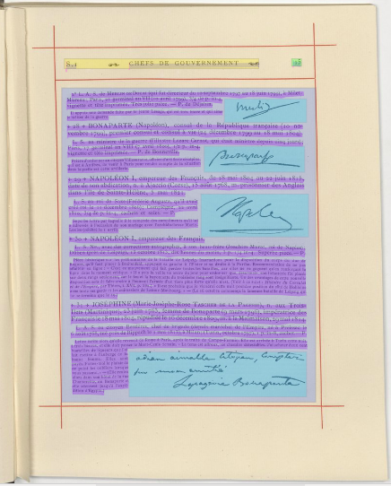
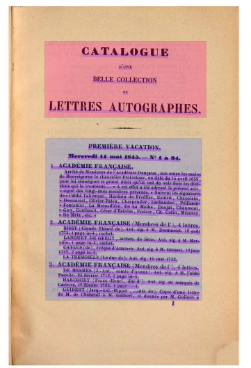

# Segmentation of the dataset

## Naming zones and lines with SegmOnto

The idea was to train a segmentation model which could automatically tag the differents zones and lines of an image, so that the post-process of transformation in TEI would be easier. Due to this, the dataset has been prepared in eScriptorium using a system of tagging lines and regions of an image. Do to that, we rely on the work done by SegmOnto initiative, which is a group aiming to create a TEI-based ontology for HTR. 

If the lines in this dataset are all defined by _default_, there are various types of zones represented. Here is a list of them and their explanation done by [SegmOnto](https://github.com/SegmOnto/examples):
  - _main_ : the main area designed to contain text, either as a single or several columns
  - _title_ : caracterises a zone containing a title distinct from the main text
  - _numbering_ : caracterises a zone containing the page number
  - _running title_ : caracterises a zone containing a running title
  - _figure_ : caracterises a zone containing a figure
  - _stamp_ :  caracterises a zone containing a figure

## Application and choices
Here are typical exemples of zones' tagging.  
Main area is in purple, title in pink, numbering in green, running title in yellow and figure in blue.

    
    
   

  
The first image is from a exhibition catalog and present the most basic structure of the dataset, which is a page containing a numbering area at the top and a large and unique main zone. The second is an annuaire's page and looks quite the same, except there are two columns of text, hence two mains' zone. This example is the second most common type of pages of the dataset. Lastly, the third image, a page of a manuscripts' fair catalog, shows the least frequent structure of the dataset, with figures imbricated in main, running title and numbering. 

Title are also a less recurent type of elements in the dataset. As it can be seen on the two images below, it has been decided only the biggest titles would be defined as title in the dataset. Therefore, a title of a part of the document is included in a main area.

    
    

