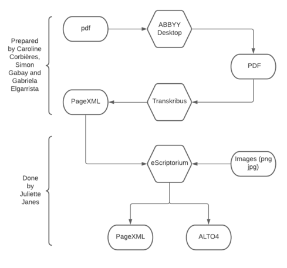

# Dataset for OCR of historical catalogs

The Artl@s project focus on the global circulation of images from the 1890s to the advent of the Internet, using digital methodologies. Among its projects, BasArt is an online database of exhibition catalogs from the 19th and 20th centuries. 
In order to broaden this database, Caroline Corbières, intern of the project in 2020, worked on the automatisation of its process. A scanned exhibition catalog is taken as an input and then encoded in XML-TEI and structured in csv. 

In this context, the aim of this repository is to improve the ocerization and segmentation of this [Catalogs Workflow](https://github.com/carolinecorbieres/ArtlasCatalogues). This stage occurs at the beginning of the workflow and transforms the data from an image to a text. 
The idea was not only to refine the OCR for [Artl@s](https://artlas.huma-num.fr/fr/) but also to make a useful tool for researchers who need to ocerize their catalogues. Therefore, this dataset holds exhibition catalogs, prepared by Caroline Corbières, catalogs of 19th to nowadays manuscripts fairs of the [Katabase](https://github.com/katabase) project, arranged by Simon Gabay and from the [Adresses et Annuaires group](https://paris-timemachine.huma-num.fr/groupe-adresses-et-annuaires/) of Paris Time Machine of the EHESS, produced by Gabriela Elgarrista. 

The dataset is composed of 150 pages, with 50 pages of each type of data. Its developed presentation is accessible in the csv file, where each page is described. The schema below explains its process of creation. The pages have been prepared and segmented in [eScriptorium](http://traces6.paris.inria.fr/) using the [SegmOnto](https://github.com/SegmOnto) ontology which allows to name the differents zones and lines. Lastly, the work done has been exported in PageXML and ALTO4 formats, accessible in this repository, along with the images used. 

<p align="center">
  
</p>

## Repository 
```
├── 1_Data
│     ├── annuaires
│     │  └── Data_segmenteur 
│     │     ├─ alto_xml
|     |     ├─ page_xml
│     │     └─ images
│     │ 
│     ├── Cat_expositions
│     │  └── Data_segmenteur
│     │     ├─ alto_xml
|     |     ├─ page_xml
│     │     └─ image
|     |
|     └── Cat_manuscrits
│        └── Data_segmenteur
│           ├─ alto_xml
|           ├─ page_xml
│           └─ image
|
├── 2_Boite_a_outils
|     └──  Dépôt commun d'outils pour la préparation des données
|
├── Dataset_190421.csv 
├── model_segmenteur_test_220421.mlmodel 
└── rapport datasetTest_segmentation.pdf
```
                  

## Thanks to 
Thanks to Simon Gabay, Claire Jahan, Caroline Corbières, Gabriela Elgarrista and Carmen Brando for their help and work.

## Credits
This repository is developed by Juliette Janes, intern of the [Artl@s](https://artlas.huma-num.fr/fr/) project, with the help of Simon Gabay under the supervision of Béatrice Joyeux-Prunel.

## Licence
This repository is CC-BY.


## Cite this repository
Juliette Janes, Simon Gabay, Béatrice Joyeux-Prunel, _Model for OCR processing Catalogs_, 2020, https://github.com/Juliettejns/cataloguesPipeline/
