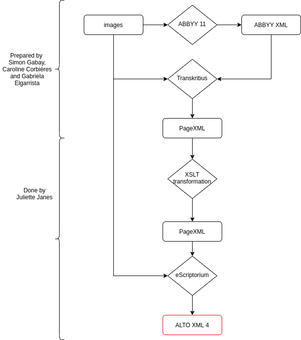

# Dataset for historical catalogs Segmentation

The Artl@s project focus on the global circulation of images from the 1890s to the advent of the Internet, using digital methodologies. Among its projects, BasArt is an online database of exhibition catalogs from the 19th and 20th centuries. 
In order to broaden this database, Caroline Corbières, intern of the project in 2020, worked on the automatisation of its process. A scanned exhibition catalog is taken as an input and then encoded in XML-TEI and structured in csv. 

In this context, the aim of this repository is to improve the ocerization and segmentation of this [Catalogs Workflow](https://github.com/carolinecorbieres/ArtlasCatalogues). This step occurs at the beginning of the workflow and transforms the data from an image to a text. 
The idea was not only to refine the OCR for [Artl@s](https://artlas.huma-num.fr/fr/) but also to make a useful tool for researchers who need to ocerize their catalogues. Therefore, this dataset holds exhibition catalogs, prepared by Caroline Corbières, catalogs of 19th to nowadays manuscripts fairs of the [Katabase](https://github.com/katabase) project, arranged by Simon Gabay and owners directories from the [Adresses et Annuaires group](https://paris-timemachine.huma-num.fr/groupe-adresses-et-annuaires/) of Paris Time Machine of the EHESS, produced by Gabriela Elgarrista. 

The dataset is composed of 282 pages, with 50 pages of Annuaires, 50 pages of manuscripts' fairs catalogs and 127 pages of exhibition catalogs. Its presentation is accessible in the csv file, where each page is described. The schema below explains its process of creation. Since the pageXML from Transkribus was displayed without the manual corrections done in the transcription, a XSLT transformation has been done on them. It can be found [here](https://github.com/Heresta/BAO_Stage_DH_ENS_2021/tree/main/CorrectionPageXMLeScriptorium). Then, the pages have been prepared and segmented in [eScriptorium](http://traces6.paris.inria.fr/) using the [SegmOnto](https://github.com/SegmOnto) ontology which allows to name the differents zones and lines. This work is developped [here](https://github.com/Juliettejns/cataloguesPipeline/blob/main/1_Data/README.md). Lastly, the work done has been exported in ALTO4 format, accessible in this repository, along with the images used. 

<p align="center">
  
</p>

## How to build the dataset
In your terminal:
1. Go to the directory ```3_Scripts_training_construction```
2. Chose the dataset you want:</br>
         - All the dataset</br>
         - Only one of the catalogs types (Annuaires, exhibition catalogs or manuscripts' fair catalogs)
3. Use the corresponding script with the command ```bash [SCRIPT]```
4. You will get a ```TrainingData``` directory containing all the data 

The primary dataset has the catalogs entries described and segmented. If you do not need them, you can use the [Transformation Sheet](https://github.com/Juliettejns/cataloguesSegmentationOCR/blob/main/1_Data/Transformation_entries.xsl) on the dataset.</br>
The test dataset used for our training can be found in the directory `3_Scripts_training_construction` along with a python script which split the data in train, test and eval datasets.
## Repository 
```
├── 1_Data
│     ├── annuaires
│     │  └── Data_segmenteur 
│     │     ├─ alto_eScriptorium
|     |     ├─ page_Transkribus
│     │     └─ images
│     │ 
│     ├── Cat_expositions
│     │  └── Data_segmenteur
│     │     ├─ alto_eScriptorium
|     |     ├─ page_Transkribus
|     |     ├─ page_transforme
│     │     └─ image
|     |
|     └── Cat_manuscrits
│        └── Data_segmenteur
│           ├─ alto_eScriptorium
|           ├─ page_Transkribus
|           ├─ page_transforme
│           └─ image
|
├── 2_ToolBox
|     └──  Joint Toolbox for dataset's preparation
|
├── 3_Scripts_training_construction
│     ├─ build_train_alto.sh
|     ├─ build_train_alto_annuaires.sh
|     ├─ build_train_alto_exhibition.sh
│     └─ build_train_alto_manuscripts.sh
|
├── images
|
└─ Dataset.csv 
```
                  

## Thanks to 
Thanks to Simon Gabay, Claire Jahan, Caroline Corbières, Gabriela Elgarrista and Carmen Brando for their help and work.

## Credits
This repository is developed by Juliette Janes, intern of the [Artl@s](https://artlas.huma-num.fr/fr/) project, with the help of Simon Gabay under the supervision of Béatrice Joyeux-Prunel.
 - Manuscripts' catalogs preparation has been done by Simon Gabay.
 - Exhibitions' catalogs preparation has been done by Caroline Corbières. 
 - Annuaires preparation has been done by Gabriela Elgarrista, under the supervision of Carmen Brando.
## Licence
Images from catalogs published prior 1920 and transcriptions are CC-BY. </br>
The other images are extracts of catalogs published after 1920 and are the intellectual property of their productor.</br>


## Cite this repository
Juliette Janes, Simon Gabay, Béatrice Joyeux-Prunel, _Dataset for Historical Catalogs Segmentation_, 2021, Paris: ENS Paris https://github.com/Juliettejns/cataloguesSegmentationOCR/

## Contacts
If you have any questions or remarks, please contact juliette.janes@chartes.psl.eu and simon.gabay@unige.ch.

